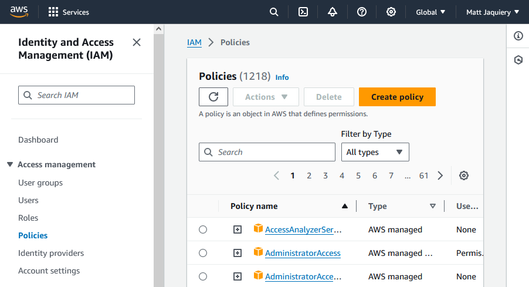

{}
The basic steps are:

1. [Create an AWS account](#create-an-aws-account)
2. [Create an S3 bucket](#create-an-s3-bucket)
3. [Configure the bucket CORS settings to allow Galv to access it](#configure-the-bucket-cors-settings)
4. [Create an IAM user with access to the bucket](#create-an-iam-user-with-access-to-the-bucket)
5. [Set up the AWS credentials in Galv](#set-up-the-aws-credentials-in-galv)
{}

## Create an AWS account

If you don't already have an AWS account, you can create one at https://aws.amazon.com/

## Create an S3 bucket

Once you've logged in to AWS, go to the S3 service and create a new bucket.
You can find the S3 service in the "Storage" section of the AWS Management Console,
or you can search for it in the search bar.


We won't go into the details of creating a bucket here, but you can find more information
in the AWS documentation: https://docs.aws.amazon.com/AmazonS3/latest/userguide/creating-bucket.html

## Configure the bucket CORS settings

Once you've created the bucket, you'll need to configure the CORS settings to allow Galv to access it.
You can do this by clicking on the bucket name in the S3 console, then going to the "Permissions" tab,
then going to the "Cross-origin resource sharing (CORS)" section.

```json
[
  {
      "AllowedHeaders": [
          "*"
      ],
      "AllowedMethods": [
          "HEAD",
          "GET"
      ],
      "AllowedOrigins": [
          "https://galv-backend-dev.fly.dev",
          "https://galv-frontend.dev.fly.dev"
      ],
      "ExposeHeaders": [],
      "MaxAgeSeconds": 3600
  }
]
```

Set the "AllowedOrigins" to the URLs of your Galv frontend and backend servers.
If you're setting things up in the frontend, the frontend URL is the URL of the site you're on,
and the backend URL can be found by going to the 'Harvesters' tab and reading the text at the top.

Once you've created the bucket, copy its ARN because you'll need it later.
On the main Buckets screen, select the bucket radio button and click 'Copy ARN'.

## Create an IAM user with access to the bucket

Next, you'll need to create an IAM user with access to the S3 bucket.
You'll want this user to have the minimum permissions necessary to access the bucket,
because the credentials will be stored in Galv and could be exposed if the server is compromised.

Galv will need to read and write files to the bucket, but it doesn't need to be able to change bucket settings.

First, go to the IAM service in the AWS Management Console.
Then go to the Policies section under 'Access management' and create a new policy.



You can use the JSON editor to create a policy like this:

```json
{
  "Version": "2012-10-17",
  "Statement": [
      {
          "Sid": "VisualEditor0",
          "Effect": "Allow",
          "Action": [
              "s3:ListBucketMultipartUploads",
              "s3:ListBucket",
              "s3:PutBucketCORS",
              "s3:GetBucketAcl",
              "s3:ListMultipartUploadParts",
              "s3:PutObject",
              "s3:GetObjectAcl",
              "s3:GetObject",
              "s3:GetObjectTorrent",
              "s3:GetBucketCORS",
              "s3:GetObjectVersionAcl",
              "s3:DeleteObject",
              "s3:GetObjectVersion"
          ],
          "Resource": [
              "arn:aws:s3:::my-galv-bucket/*",
              "arn:aws:s3:::my-galv-bucket"
          ]
      }
  ]
}
```

Make sure to replace the entries in 'Resource' with the ARN of your bucket, which you can find in the bucket properties.

Next, create a new user in the IAM service and attach the policy you just created to the user.
If you prefer to use Groups, you can create a Group and attach the policy to the Group instead,
then add the user to the Group.

Finally, create an access key for the user and save the Access Key ID and Secret Access Key.
Do that by selecting your user from the Users section and going to the 'Security credentials' tab.
Create an 'Access key' for a 'Third-party service' or 'Application running outside AWS'.
Copy the Access Key ID and Secret Access Key because you'll need to enter them in Galv.

## Set up the AWS credentials in Galv

Finally, you'll need to enter the AWS credentials in Galv so that it can access the S3 bucket.
Click on the 'Additional storage' icon in the navigation bar, then click 'Create new additional storage'.

You can fill out the form using the Access Key ID and Secret Access Key you created in the previous step,
and you'll also need the bucket name and the AWS region the bucket is in.
The 'location' field allows you to specify a path within your bucket where files will be stored.

Fill out the information, make sure the storage is set to 'enabled',
and click the green floppy disc icon to create your storage.

You should now be able to upload files to your S3 bucket from Galv,
and Galv will take care of making sure that the appropriate people can access them.