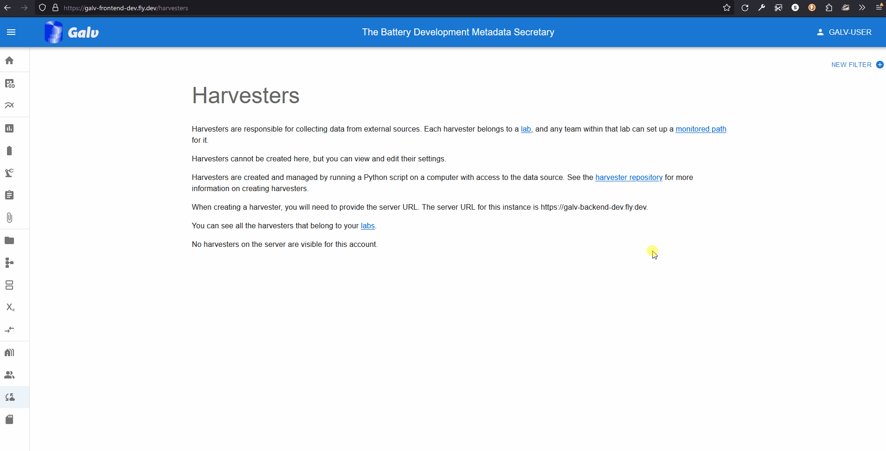
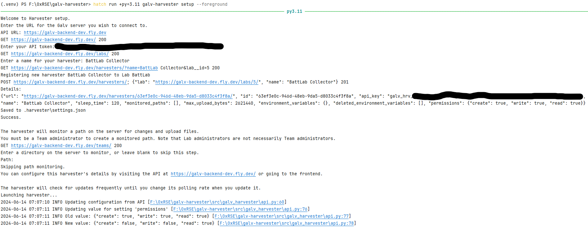

{}
Before you begin this tutorial, you'll need to have an account on Galv and be a Lab Administrator.
You should also have a Team set up in your Lab, and be a member of that Team.
To learn how to get to this point, see the [Getting Started](../getting-started) guide, and follow through the steps:

- [Creating an Account]({}#creating-an-account)
- [Creating a Lab]({}#creating-a-lab)
- [Creating a Team]({}#creating-a-team)
{}

## Creating a Harvester

A Harvester is a tool that collects data from a source and stores it in Galv.

Within Galv, click on the 'Harvesters' tab in the navigation bar on the left.
You'll see a description of what a Harvester is.
If you had any Harvesters, you'd see them listed here.

Harvesters can only be created by a Lab Administrator.
Any Team in the Lab can use a Harvester once it's created.

There's no 'Create Harvester' button on the Harvesters page.
This is because Harvesters are created by running a Python script on the machine where the data is stored.

When we create the Harvester, we'll need to know the URL of the Galv API, and we'll need an API Token to authorise the creation of the Harvester.

The URL of the Galv API is shown in the text at the top of the Harvesters page.

## Getting the API Token

You access your API Tokens through your user profile.
Click on your username in the top right corner of the page to open the user menu.
Click on 'Tokens' to see your API Tokens.

Click the 'Create Token' button to create a new API Token.

Give your Token a name, set its expiry for 3600s (1 hour), and click 'Create'.
You'll get a once-only chance to copy the Token to your clipboard.
Do that now.

## Creating the Harvester

Go to the machine where the data is stored and open a terminal.
Run `pip install galv-harvester` to install the Galv Harvester Python package.

Installing the package gives you the `galv-harvester` command.
Run `galv-harvester --help` to see the options.

We want to set up a Harvester, so run `galv-harvester setup`.
You'll be prompted for the URL of the Galv API and your API Token.

Enter the URL of the Galv API and your API Token when prompted.
You'll be asked for the name of the Harvester.
Enter a name for the Harvester and press Enter.

That is enough to create the Harvester.
You'll be prompted to create a Path for the Harvester to find data, but we'll do that using the Frontend, so press Enter to skip that step.

You can see what the setup process looks like in the image below.

Once the Harvester is created, you can close the terminal and it will continue running in the background.

Go back to the Frontend and refresh the Harvesters page.
You'll see your Harvester listed there.

## The Harvester in action

The Harvester is now running and collecting data.
For the Harvester to work, you need to create a Path for it to find data.

Click on the 'Paths' tab in the navigation bar on the left.
You'll see a description of what a Path is.
If you had any Paths, you'd see them listed here.

Click the 'Create Path' button to create a new Path.

We'll need to enter the following information:

1. The absolute path to the directory where the data is stored.
2. A regular expression to match the files we want to collect.
I used `.*` to match all files.
3. The time a file must be unchanged before it's collected.
This is useful for files that are being written to.
4. Whether the Path is active.
If it's not active, the Harvester won't collect data from it.
5. How many lines of data should be stored in each dataset partition.
This is useful for large files.
6. The Harvester that will collect data from this Path.
7. The Team that will own the data collected from this Path.

Once you've entered the information, click the green floppy disc 'save' icon to create the Path.

The Harvester will now collect data from the Path you created.
Let's wait a few minutes for the Harvester to collect some data, then go to the Files page to see what it's collected.

## Viewing the collected data

You'll see the data files that have been Harvested listed on the Files page.
Initially, all the files will be marked as 'GROWING'.

Once the Harvester has seen that they are stable, they will be imported.
You can see the status of the files change from 'GROWING' to 'IMPORTING' to 'IMPORTED'.

Galv renames some columns in the data files to make them easier to work with.
This process is called 'mapping'.
You can create your own mappings or use the default mappings provided by Galv.

Where there's a mapping that works best for a particular file, Galv will automatically use it to import the data.
Hopefully you'll see some files imported and mapped on the Files page.
They should be accompanied by an image that shows a preview of the data.

You can click on the File to see the data in more detail, and download the dataset.

To download the dataset, expand the card for an IMPORTED File, click one of its 'Parquet partitions', and then click the 'Download' button.
You'll see that some columns have been renamed to match Galv's naming conventions: `ElapsedTime_s` for the primary time column, and `Voltage_V` and `Current_A` for the primary data columns.

Data are only as good as the metadata that describes them, so remember to add metadata to the dataset.