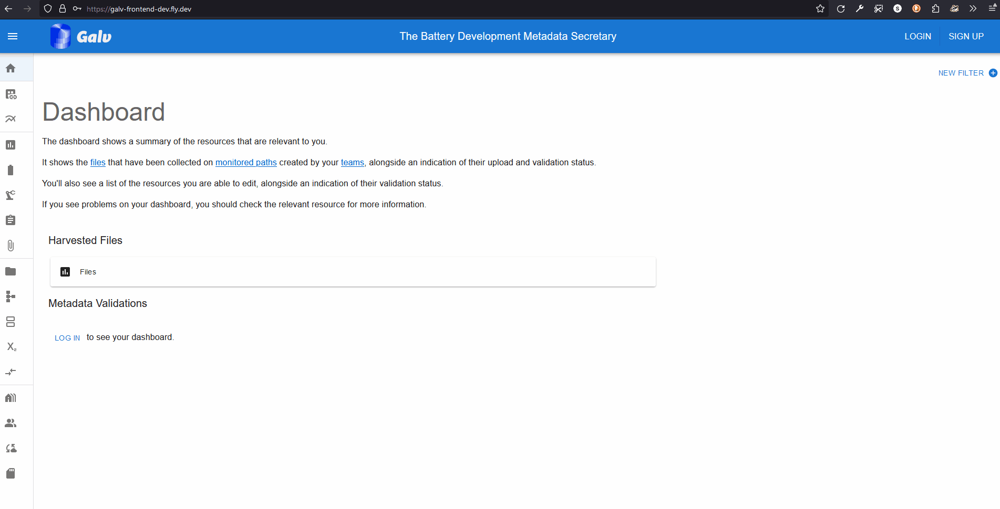
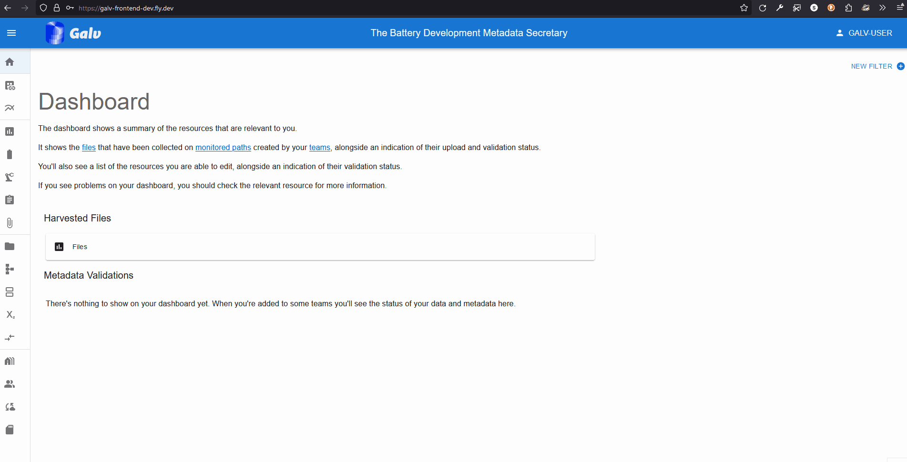
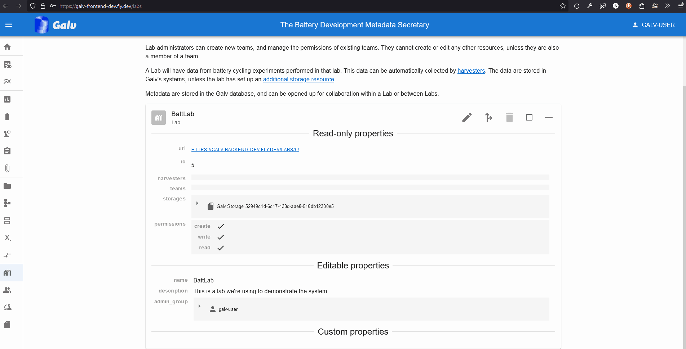
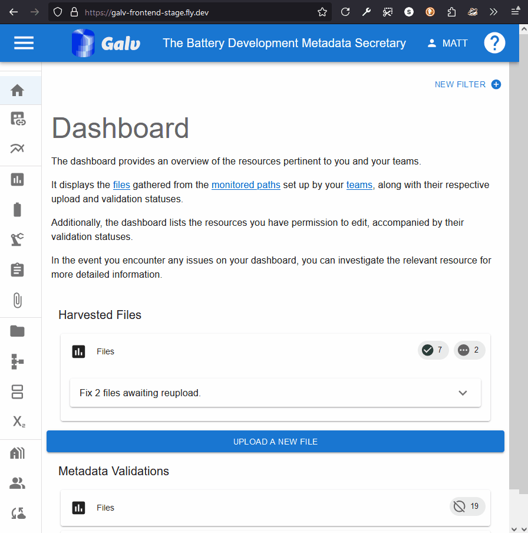
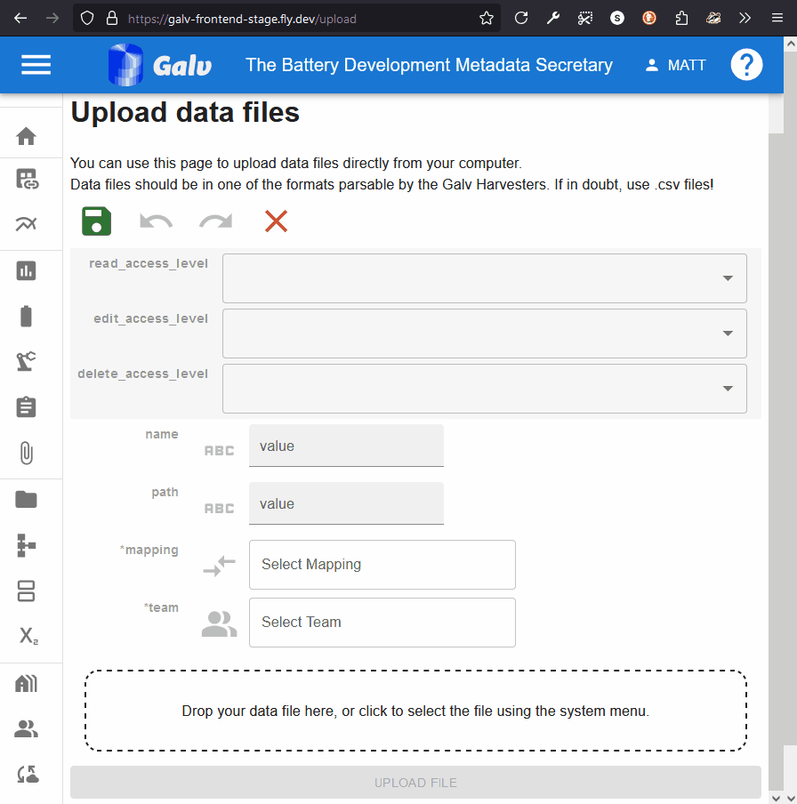
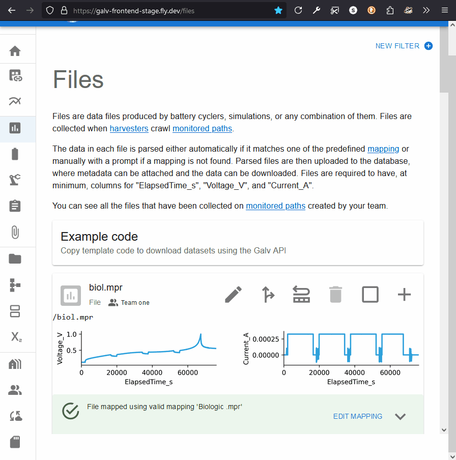
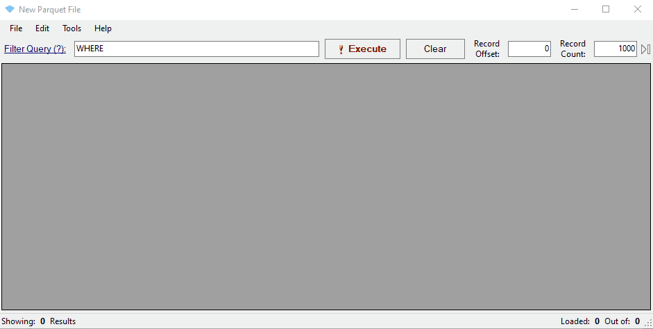
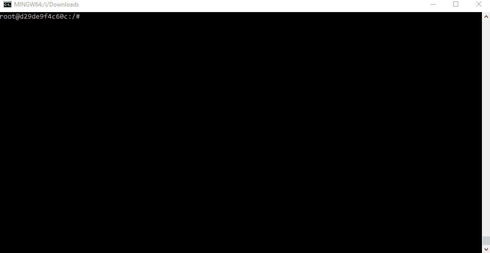

## Creating an account

Go to the Galv Frontend and create an account.
You do this using the 'sign up' button in the top right corner of the page.

Fill in your details and click 'Sign up'.
You'll be sent an email with a code to verify your account.
Enter the code on the verification page to complete the process.

## Creating a Lab

The first thing we need as a user is a Lab.
Normally, you'll join someone else's Lab, but for now, we'll create our own.

Click on the 'Labs' tab in the navigation bar on the left.
You can expand the bar to see the icon names by clicking the hamburger icon in the top left corner of the page.

On the Labs page you'll see a description of what a Lab is.
If you belonged to a Lab, you'd see it listed here.

Click the 'Create Lab' button to create a new Lab.

A Lab needs a name, so enter one in the 'Name' field.
You can also add a description if you like.

A Lab also needs an Administrator.
You're the first user in this Lab, so you'll be the Administrator.
Select your username from the dropdown list.

Click the green floppy disc 'save' icon to create the Lab.

You will now see your Lab listed on the Labs page.
You can click the '+' icon to expand the Lab and see more details.

## Creating a Team

Now that we have a Lab, we can create a Team.
A Team is a group of users who work together on a project.

Click on the 'Teams' tab in the navigation bar on the left.
You'll see a description of what a Team is.
If you belonged to a Team, you'd see it listed here.

Click the 'Create Team' button to create a new Team.

Enter the name of your Team in the 'Name' field.
Select your Lab from the dropdown list.

We can add users as Team members or Team admins.
For now, we'll just add ourselves as a Team admin.
Select your username from the dropdown list in the 'Team Admins' field.

Click the green floppy disc 'save' icon to create the Team,
and you'll see your Team listed on the Teams page.

## Uploading a dataset

Now that we have a Lab and a Team, we can upload some data.

### Uploading a known file type

We'll start by uploading a file that Galv knows how to handle.
Download the BioLogic .mpr file from the link below:
https://github.com/jepegit/cellpy/raw/refs/heads/master/testdata/data/biol.mpr

Next, go to Galv and click the 'Upload a New File' button in either the Dashboard or the Files page.

Drop the file you downloaded into the upload area, or click the 'Choose a file' button to select it from your computer.
Make sure you select the 'BioLogic .mpr' from the 'mapping' dropdown list.
Assign the file to your Team, and (optionally) add a custom name for the file.
Then click 'Upload File' to start the upload process.

Once the file is uploaded, you will be taken to its page.
You can see the metadata that Galv has extracted from the file,
and you can add any custom properties you need.

At the bottom you'll see a graph of the data in the file.

### Uploading an unknown file type

You may not know the file type of the data you're uploading.
That's okay - Galv can still handle it.

Let's pretend we don't know the file type of the data we're uploading.
Go to the Files page and click the 'Upload a New File' button.

Drop the .mpr file you downloaded in the previous step into the upload area,
or click the 'Choose a file' button to select it from your computer.

Leave the 'mapping' dropdown list blank.
Select your team and (optionally) add a custom name for the file.
Then click 'Upload File' to start the upload process.

Once the file is uploaded, you will be taken to its page.

Notice that Galv says the file is unmapped, and that you don't see any parquet partitions (data)
or a preview image.
At the bottom of the page, you'll see Galv is warning you that the file is unmapped.
Use the dropdown within that warning area to select the correct mapping for the file.

Notice that whereas in the previous example you had lots of mappings to choose from,
now you only have two.
That's because Galv has detected that only two mappings are compatible with the data in the file.

Select the correct mapping (Biologic .mpr) and click 'Map File'.

You'll see that the mapping has now been applied, and Galv is asking you to reupload the file.
This is because the file needs to be reprocessed with the new mapping.

Drop the file into the upload area again, or click the 'Choose a file' button to select it from your computer.
Click 'Upload File' to finish the upload process.

Once the file is uploaded, you'll see the data and the preview image appear on the File's page, just like before.
You'll also see that Galv is now telling us that the file is correctly mapped.

### Viewing your data

When Galv imports data from a file, it applies some light processing to it so that it is compatible with other
Galv files.
It also saves the data in `.parquet <https://parquet.apache.org/>`_ format,
which is a columnar storage format that is efficient for querying.
Parquet files are broken into partitions, which each contain a subset of the data (e.g. 100,000 rows).

You can see the partitions for a File by expanding its card and looking for 'parquet_partitions'.

Clicking the partition will take you to the page for the Partition.
This page will have a download button under 'parquet_file'.
Clicking this button will download prepare the file for download,
and, when it's ready, you'll be able to save it to your computer.

You can view the contents of a parquet file using a tool like
`ParquetViewer <https://github.com/mukunku/ParquetViewer>`_ on Windows,
or by using the `parquet-tools <https://pypi.org/project/parquet-tools/>`_ Python package.

Notice that the mapping has renamed three key columns in the data:
- ElapsedTime_S
- Voltage_V
- Current_A

## Next steps

Now you've learned how to upload data, upload some data files of your own.
Once you've done that, you can learn about how to [Manage Resources]({})
so that you can tie information about Cells and other resources to your data.